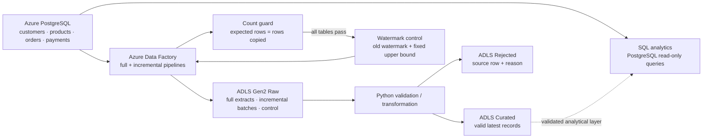
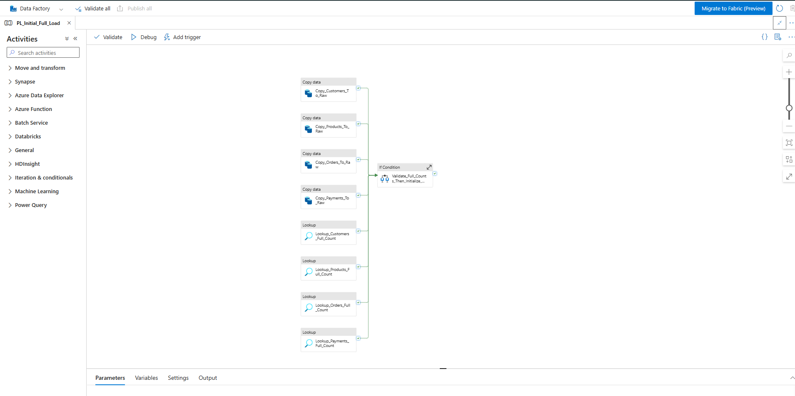
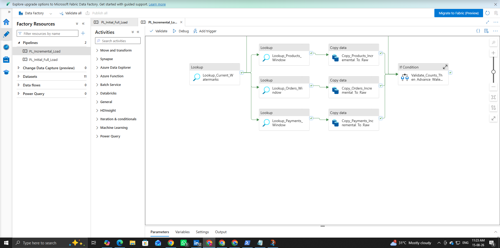

# Order-to-Revenue Data Pipeline

An Azure data engineering portfolio project that moves synthetic e-commerce
data from Azure Database for PostgreSQL through Azure Data Factory (ADF) into
Azure Data Lake Storage Gen2 (ADLS), separates valid records from explainable
rejects, and reconciles order-to-revenue analytics. The implemented full and
incremental pipelines were executed successfully; the evidence set is current
through 2026-08-15.

## Business problem

Order, customer, product, and payment data must arrive in an analytical layer
without silent loss. The pipeline supports an initial load, bounded incremental
loads, explicit rejection reasons, count reconciliation, and a confirmed-
revenue rule that requires a completed order, valid relationships, a successful
latest payment, and an exact payment-to-order amount match.

## Architecture



The included SQL analytics execute against PostgreSQL; curated ADLS output is
the validated analytical layer and is not queried through a separately
provisioned engine. Synapse, Databricks, Fabric, VMs, and ADF mapping-data-flow
compute are intentionally outside the implemented scope.

## Technology stack

| Area | Implementation |
|---|---|
| Source | Azure Database for PostgreSQL Flexible Server 17 |
| Orchestration | Azure Data Factory Lookup, Copy, If, and Fail activities |
| Data lake | ADLS Gen2 with `raw`, `curated`, and `rejected` containers |
| Processing | Python 3.11 standard library |
| Analytics | Read-only PostgreSQL SQL |
| Validation | `unittest`, JSON definition checks, count and hash reconciliation |
| Operations | Azure CLI and Azure RBAC; PostgreSQL `psql` over TLS |

## End-to-end data flow

1. Deterministic synthetic rows model customers, products, orders, payments,
   and controlled quality scenarios.
2. `PL_Initial_Full_Load` copies all four PostgreSQL tables to ADLS raw CSVs.
3. `PL_Incremental_Load` reads the current watermarks, captures fixed source
   upper bounds, and copies only rows in `(old_watermark, new_watermark]`.
4. Python validates types, constraints, relationships, versions, and payment
   reconciliation, then writes every raw row to curated or rejected output.
5. SQL reports revenue, customer/product performance, status trends, and
   outstanding orders using the same confirmed-revenue rules.

## Azure Data Factory Pipelines

The implementation uses two primary ADF pipelines: `PL_Initial_Full_Load` for
the baseline extraction and `PL_Incremental_Load` for repeatable changed-data
processing.

### Initial Full Load



The initial pipeline loads customers, products, orders, and payments from Azure
PostgreSQL into the ADLS raw layer. Per-table source lookups and copied-row
counts feed a reconciliation guard before initial watermarks are written.

### Incremental Load



The incremental pipeline maintains an independent `updated_at` watermark for
each table, captures a fixed upper bound, and runs bounded per-table Lookup and
Copy activities. Watermarks advance only after every copied count validates,
and unique `run_id` sink paths prevent reruns from overwriting earlier batches.

## Full-load architecture

The full-load pipeline copies the four source tables in parallel, performs a
source-count lookup for each, and compares those counts with ADF `rowsCopied`.
Initial watermarks are written only inside the successful count branch. A
mismatch follows a native Fail activity, so control state is never initialized
from an incomplete load.

## Incremental-load and watermark strategy

All four tables use the indexed, non-null `updated_at` column plus the table
primary key. Each run reads the previous watermark and captures a fixed upper
boundary, producing a deterministic half-open window:

```text
previous watermark < updated_at <= captured upper watermark
```

ADF stores each output under a watermark and unique pipeline run ID:

```text
raw/<table>/incremental/watermark=<UTC>/run_id=<RunId>/<table>.csv
```

The pipeline advances the current watermark only after all four bounded source
counts equal their copied row counts. It also writes append-only watermark
history. Failed retries therefore reuse the same lower boundary, while the
transformation layer resolves repeated primary keys by latest `updated_at`.

## Raw, curated, and rejected layers

- `raw`: immutable full extracts, run-versioned incremental files, and control
  records.
- `curated`: valid current records with unique primary keys.
- `rejected`: original fields plus a stable `rejection_reason`; superseded
  versions remain visible as `SUPERSEDED_BY_LATER_VERSION`.

Structurally valid failed, pending, and refunded payments remain curated but do
not contribute to confirmed revenue. No bad record is silently discarded.

## Data-quality checks and reconciliation

Checks cover required fields, type parsing, allowed statuses/methods, positive
values, timestamp ordering, duplicate versions, primary-key uniqueness,
customer/product/order relationships, quantity, and successful-payment amount
matching. The core reconciliation invariant is:

```text
raw rows = curated rows + rejected rows
```

The deterministic baseline produced these verified results:

| Table | Raw | Curated | Rejected |
|---|---:|---:|---:|
| customers | 2,000 | 2,000 | 0 |
| products | 300 | 300 | 0 |
| orders | 10,000 | 9,953 | 47 |
| payments | 9,990 | 9,943 | 47 |

The retained controlled incremental test left PostgreSQL at 2,001 customers,
301 products, 10,001 orders, and 9,991 payments. Detailed boundaries and proof
are in [validation results](docs/results/VALIDATION_RESULTS.md) and the
[controlled incremental results](docs/results/CONTROLLED_INCREMENTAL_TEST_RESULTS.md).

## Analytics

[Order-to-revenue analytics](database/analytics/07_analytics_queries.sql)
includes confirmed order count, total and daily revenue, average order value,
product/category ranking, customer/location performance, order and latest-
payment status analysis, and outstanding orders. On the verified live source,
8,941 orders met the confirmed-revenue rule for `307,416,040.00` in revenue.

## Major debugging lesson: run-ID sink-path remediation

A controlled rerun correctly extracted zero source rows but exposed a storage
design defect: a path based only on the watermark allowed a zero-row rerun to
overwrite the prior non-zero batch. The fix added
`run_id=<pipeline().RunId>` to all four incremental sink paths.

Two controlled retests then proved the remediation: the first copied exactly
one row per table, the second copied zero, both wrote separate paths, and hashes
confirmed that the first run's files remained unchanged. This was a sink-path
idempotency issue, not a watermark-query failure.

## Repository structure

```text
azure/
  adf/                    Generated, sanitized ADF datasets and pipelines
  deployment/             Sanitized pre-deployment snapshots
database/
  ddl/                    Schema and constraints
  queries/                Validation, watermark, and controlled-test SQL
  analytics/              Read-only business analytics
scripts/
  ingestion/              Data generation and PostgreSQL load helpers
  transformation/         Raw-to-curated/rejected processing
  validation/             Reconciliation and evidence checks
  deployment/             ADF generation and explicit Azure operations
tests/                    Unit and ADF definition tests
docs/                     Architecture, images, interview, operations, results, evidence
data/generated/           Ignored reproducible local data
```

## How to run and reproduce locally

Prerequisites are Python 3.11+, with `psql` and Azure CLI needed only for their
respective database/Azure operations. No pip packages are required.

```powershell
python -m scripts.ingestion.generate_data
python -m scripts.ingestion.add_incremental_batch
python -m scripts.validation.validate_generated_data
python -m unittest discover -s tests -v
python -m scripts.deployment.build_adf_definitions
```

To exercise the local lake transformation without touching Azure:

```powershell
python -m scripts.transformation.process_raw_to_curated `
  --raw-dir data/generated `
  --curated-dir work/local-lake/curated `
  --rejected-dir work/local-lake/rejected `
  --summary-file work/local-lake/processing-summary.json

python -m scripts.validation.validate_lake_outputs `
  --raw-dir data/generated `
  --curated-dir work/local-lake/curated `
  --rejected-dir work/local-lake/rejected
```

Do not run `scripts.ingestion.load_to_postgres` against the completed Azure
database: it contains an intentional local-development truncate and reload.
Azure deployment and pipeline-run helpers are never invoked by tests or by the
definition builder.

## Testing

The standard-library suite verifies deterministic lake reconciliation,
latest-version deduplication, valid JSON, linked-service/dataset references,
full-load count guarding, watermark advancement placement, and unique
incremental run paths. ADF definitions are regenerated during the suite so
committed JSON cannot drift silently from the builder.

## Security

- `.env`, credential files, dumps, logs, caches, local work, and generated data
  are excluded from Git.
- The repository stores no linked-service credentials, PostgreSQL passwords,
  storage keys, SAS tokens, or connection strings containing credentials.
- Database access uses TLS and external `psql` authentication; ADLS inspection
  uses Azure RBAC rather than account keys.
- Evidence and documentation images must be sanitized before commit.

## Cost-conscious Azure decisions

The project reuses one burstable PostgreSQL server, one Standard LRS ADLS Gen2
account, and one ADF instance. It uses low-volume Lookup/Copy/control activities
and Python rather than provisioning an additional analytics engine, Spark
cluster, dedicated integration runtime, HA, geo-redundancy, or premium tier.

## Limitations and production improvements

- A timestamp watermark can miss a late commit carrying an older `updated_at`;
  production CDC or log-based replication would close that gap.
- The initial full load assumes a quiet synthetic source; production should use
  a consistent database snapshot or CDC bootstrap.
- Scheduling, alerting, centralized observability, schema-drift handling,
  automated retention, private endpoints, and managed-identity database auth
  are not implemented.
- The included SQL runs on PostgreSQL. A larger production platform could serve
  curated lake data through an appropriately governed analytical engine.

## Detailed documentation

- [Architecture](docs/architecture/architecture.md) and
  [data model](docs/architecture/data_model.md)
- [Azure execution results](docs/results/AZURE_EXECUTION_RESULTS.md)
- [Validation results](docs/results/VALIDATION_RESULTS.md)
- [Interview guide](docs/interview/INTERVIEW_GUIDE.md) and
  [safe live demo](docs/interview/LIVE_DEMO_GUIDE.md)
- [ADF definition notes](azure/adf/README.md)
