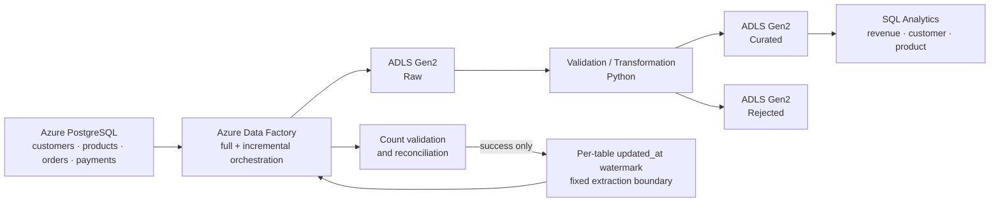
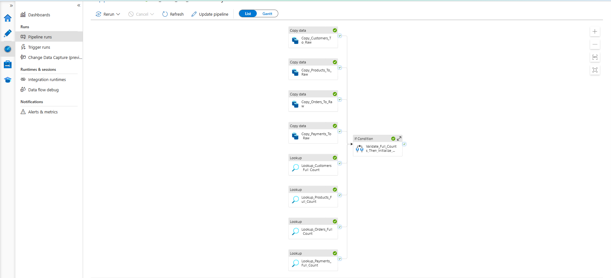
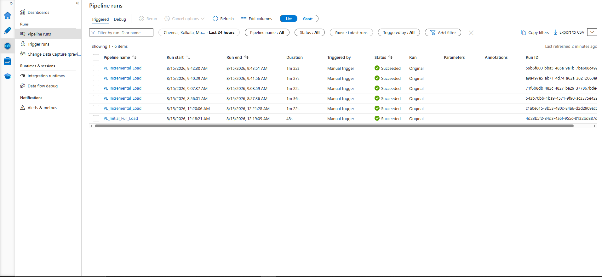
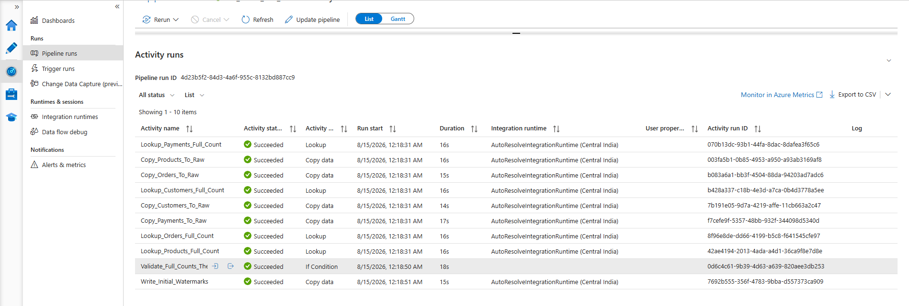
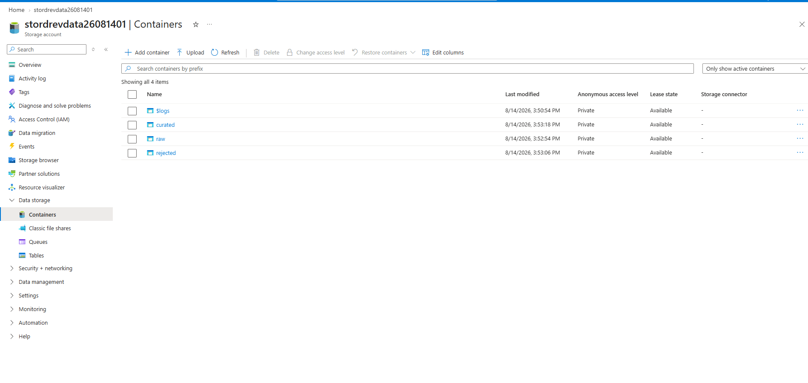
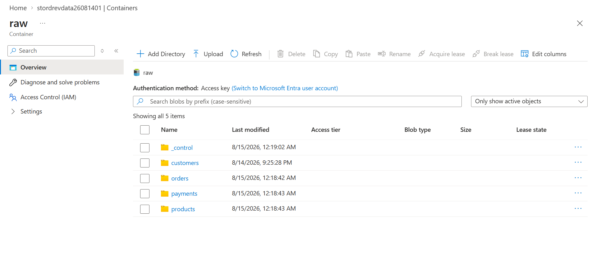
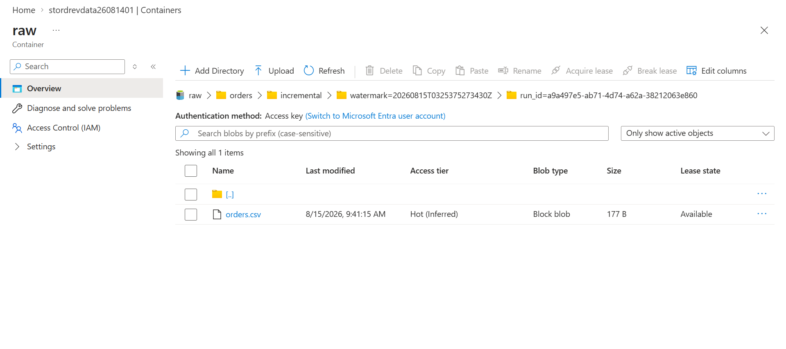
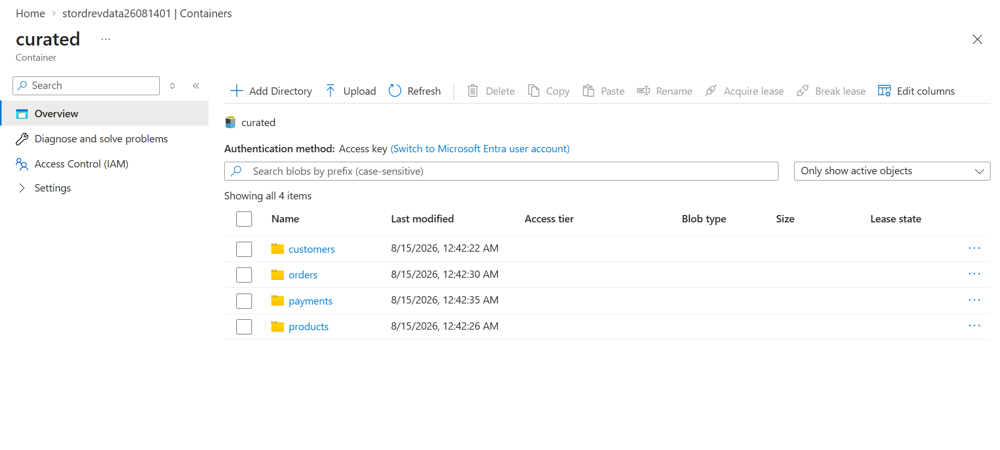
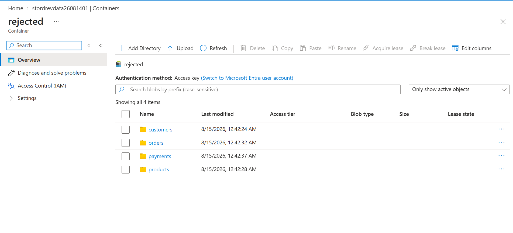
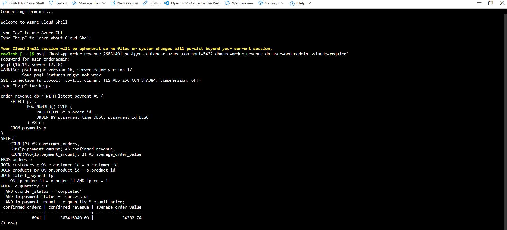

# Order-to-Revenue Data Pipeline

Production-style Azure data engineering pipeline that ingests order-to-revenue data from Azure PostgreSQL through Azure Data Factory into ADLS Gen2, with full and incremental loading, independent watermarks, data-quality routing, reconciliation, analytics, and verified idempotent reruns.


The full and incremental pipelines were executed successfully in Azure and the implementation was validated against real pipeline runs, ADLS outputs, reconciliation checks, and an idempotent rerun test. Evidence is current through 2026-08-15.

## Architecture



Incremental control is deliberately bounded: each table reads its prior `updated_at` watermark, captures a fixed upper boundary, extracts `(old_watermark, new_watermark]`, validates copied counts, and advances control state only after every table succeeds.

## Business Problem

Customer, product, order, and payment data must reach an analytical layer without silent loss or double processing. This project implements an initial load, independent per-table incremental loads, explainable rejection routing, end-to-end count reconciliation, and a confirmed-revenue rule that requires a completed order, valid relationships, a successful latest payment, and an exact payment-to-order amount match.

## Technology Stack

| Area | Implementation |
|---|---|
| Source | Azure Database for PostgreSQL Flexible Server 17 |
| Orchestration | Azure Data Factory Lookup, Copy, If Condition, and Fail activities |
| Data lake | ADLS Gen2 `raw`, `curated`, and `rejected` containers |
| Processing | Python 3.11 standard library |
| Analytics | Read-only PostgreSQL SQL |
| Validation | `unittest`, JSON definition checks, count reconciliation, and SHA-256 proof |
| Operations | Azure CLI, Azure RBAC, and PostgreSQL `psql` over TLS |

## Data Flow

1. Deterministic synthetic data models customers, products, orders, payments, and controlled quality scenarios.
2. `PL_Initial_Full_Load` copies all four source tables to the ADLS raw layer.
3. `PL_Incremental_Load` extracts bounded changes using independent table watermarks.
4. Python validates types, constraints, relationships, record versions, and payment reconciliation.
5. Every raw row is retained in either curated or rejected output with an explainable disposition.
6. SQL reports confirmed revenue, customer and product performance, status trends, and outstanding orders.

## Azure Data Factory Pipelines

### Initial Full Load

[](docs/images/adf/adf-full-load-pipeline.png)

`PL_Initial_Full_Load` loads customers, products, orders, and payments from Azure PostgreSQL into ADLS raw. Per-table source lookups and ADF `rowsCopied` values feed a reconciliation guard; initial watermarks are written only after every count matches.

### Incremental Load

[](docs/images/adf/adf-incremental-load-pipeline.png)

`PL_Incremental_Load` uses independent `updated_at` watermarks, fixed upper bounds, and per-table Copy activities. Counts must validate before watermarks advance, while a unique pipeline `run_id` in each sink path prevents reruns from overwriting earlier extracts.

## Execution Evidence

| Successful full-load execution flow | Successful pipeline runs |
|---|---|
| [](docs/images/adf/architecture-pipeline-overview.png) | [](docs/images/adf/adf-successful-pipeline-runs.png) |

### Full-load activity validation

[](docs/images/adf/adf-full-load-activity-validation.png)

The Monitor evidence shows successful Copy, Lookup, validation, and initial-watermark activities. Detailed run IDs, counts, and validation records remain in [Azure execution results](docs/results/AZURE_EXECUTION_RESULTS.md) and [validation results](docs/results/VALIDATION_RESULTS.md).

## ADLS Gen2 Data Lake Design

[](docs/images/adls/adls-data-lake-layers.png)

- **Raw:** immutable full extracts, run-versioned incremental batches, and watermark control records.
- **Curated:** valid current records with unique primary keys.
- **Rejected:** original source fields plus a stable `rejection_reason`; superseded versions remain visible as `SUPERSEDED_BY_LATER_VERSION`.
- **Incremental versioning:** separates the logical watermark window from the physical pipeline attempt.

| Raw layer | Incremental `run_id` versioning |
|---|---|
| [](docs/images/adls/adls-raw-layer.png) | [](docs/images/adls/adls-incremental-run-id-path.png) |

| Curated layer | Rejected layer |
|---|---|
| [](docs/images/adls/adls-curated-layer.png) | [](docs/images/adls/adls-rejected-layer.png) |

## Data Quality and Reconciliation

Checks cover required fields, type parsing, allowed statuses and methods, positive values, timestamp ordering, duplicate versions, primary-key uniqueness, customer/product/order relationships, quantity, and successful-payment amount matching. No invalid record is silently discarded.

The core invariant is:

```text
raw rows = curated rows + rejected rows
```

Verified deterministic baseline:

| Table | Raw | Curated | Rejected |
|---|---:|---:|---:|
| customers | 2,000 | 2,000 | 0 |
| products | 300 | 300 | 0 |
| orders | 10,000 | 9,953 | 47 |
| payments | 9,990 | 9,943 | 47 |

Final PostgreSQL counts after the controlled incremental test were 2,001 customers, 301 products, 10,001 orders, and 9,991 payments. The verified analytical result was 8,941 confirmed orders and `307,416,040.00` in confirmed revenue.

## Incremental Loading Strategy

Each table uses its indexed, non-null `updated_at` column plus its primary key. A run reads the prior watermark and captures a fixed source upper bound, producing the deterministic window:

```text
previous watermark < updated_at <= captured upper watermark
```

The pipeline advances the current watermark only when bounded source counts equal copied-row counts for all four tables. Append-only watermark history supports auditability, while the transformation layer resolves repeated primary keys using the latest `updated_at`.

## Reliability Lesson: Idempotent Incremental Loads

Controlled testing exposed a real storage defect. The original sink path reused the same location when a zero-change rerun retained its watermark:

```text
<table>/incremental/watermark=<timestamp>/<table>.csv
```

That rerun could overwrite the earlier non-zero extract. The corrected path makes every physical attempt unique:

```text
<table>/incremental/watermark=<timestamp>/run_id=<pipeline-run-id>/<table>.csv
```

After remediation, the first controlled run copied exactly one customer, product, order, and payment; an immediate rerun copied zero rows for every table. The first-run files remained unchanged, SHA-256 verification passed, and both watermark idempotency and append-only retention passed. See the [controlled incremental test results](docs/results/CONTROLLED_INCREMENTAL_TEST_RESULTS.md) for the full proof.

## Analytics

[Order-to-revenue analytics](database/analytics/07_analytics_queries.sql) includes confirmed order count, total and daily revenue, average order value, product and category ranking, customer and location performance, order and latest-payment status analysis, and outstanding orders. The SQL executes read-only against PostgreSQL; no unimplemented lake query engine is claimed.

### Verified Revenue Output

After the pipeline and data-quality workflow, the [verified revenue SQL](database/analytics/07_analytics_queries.sql) was executed read-only against Azure PostgreSQL and produced the final business KPIs below. This is backend SQL output evidence; the project does not claim a Power BI or dashboard implementation.

[](docs/images/analytics/azure-postgresql-revenue-output.png)

| Metric | Result |
|---|---:|
| Confirmed Orders | 8,941 |
| Confirmed Revenue | 307,416,040.00 |
| Average Confirmed Order Value | 34,382.74 |

## Testing

The standard-library suite verifies deterministic lake reconciliation, latest-version deduplication, valid JSON, linked-service and dataset references, full-load count guarding, watermark advancement placement, and unique incremental run paths. ADF definitions are regenerated during the suite so committed JSON cannot drift silently from the builder.

Verified release state:

- regression/static tests: **7/7 PASS**
- ADF definition validation: **PASS**
- source idempotency: **PASS**
- watermark idempotency: **PASS**
- append-only retention: **PASS**
- duplicate processing: **none**
- secret scan: **PASS**

## Security

- `.env`, credential files, dumps, logs, caches, local work, and generated data are excluded from Git.
- `.env.example` contains placeholders only; the repository stores no linked-service credentials, PostgreSQL passwords, storage keys, SAS tokens, or credentialed connection strings.
- Database connectivity requires TLS, and runtime authentication remains outside source control.
- ADF definitions, evidence files, and screenshots are reviewed for public-safe publication.

## Cost-Conscious Azure Decisions

The implementation uses one burstable PostgreSQL server, one Standard LRS ADLS Gen2 account, and one ADF instance. Low-volume Lookup, Copy, and control activities plus local Python processing avoid an additional analytics engine, Spark cluster, dedicated integration runtime, high availability, geo-redundancy, or premium tier.

## Repository Structure

```text
azure/
  adf/                    Generated, sanitized ADF datasets and pipelines
  deployment/             Sanitized pre-deployment snapshots
database/
  ddl/                    Schema and constraints
  queries/                Validation, watermark, and controlled-test SQL
  analytics/              Read-only business analytics
scripts/
  ingestion/              Data generation and PostgreSQL load helpers
  transformation/         Raw-to-curated/rejected processing
  validation/             Reconciliation and evidence checks
  deployment/             ADF generation and explicit Azure operations
tests/                    Unit and ADF definition tests
docs/                     Architecture, images, interview, operations, results, evidence
data/generated/           Ignored reproducible local data
```

## Running and Reproducing Locally

Prerequisites are Python 3.11+. `psql` and Azure CLI are needed only for their respective database and Azure operations; no pip packages are required.

```powershell
python -m scripts.ingestion.generate_data
python -m scripts.ingestion.add_incremental_batch
python -m scripts.validation.validate_generated_data
python -m unittest discover -s tests -v
python -m scripts.deployment.build_adf_definitions
```

To exercise the lake transformation without touching Azure:

```powershell
python -m scripts.transformation.process_raw_to_curated `
  --raw-dir data/generated `
  --curated-dir work/local-lake/curated `
  --rejected-dir work/local-lake/rejected `
  --summary-file work/local-lake/processing-summary.json

python -m scripts.validation.validate_lake_outputs `
  --raw-dir data/generated `
  --curated-dir work/local-lake/curated `
  --rejected-dir work/local-lake/rejected
```

Do not run `scripts.ingestion.load_to_postgres` against the completed Azure database: it contains an intentional local-development truncate and reload. Azure deployment and pipeline-run helpers are never invoked by tests or by the definition builder.

## Production Improvements

- Replace timestamp-only change detection with CDC or log-based replication to cover late commits carrying older `updated_at` values.
- Bootstrap the full load from a consistent database snapshot.
- Add scheduling, alerting, centralized observability, schema-drift handling, automated retention, and private networking.
- Use managed-identity database authentication and a governed analytical serving layer where production scale requires them.

## Documentation

- [Architecture](docs/architecture/architecture.md) and [data model](docs/architecture/data_model.md)
- [Azure execution results](docs/results/AZURE_EXECUTION_RESULTS.md)
- [Validation results](docs/results/VALIDATION_RESULTS.md)
- [Controlled incremental test results](docs/results/CONTROLLED_INCREMENTAL_TEST_RESULTS.md)
- [Interview guide](docs/interview/INTERVIEW_GUIDE.md) and [safe live demo](docs/interview/LIVE_DEMO_GUIDE.md)
- [ADF definition notes](azure/adf/README.md)

## License

Licensed under the [MIT License](LICENSE).
