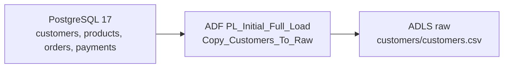
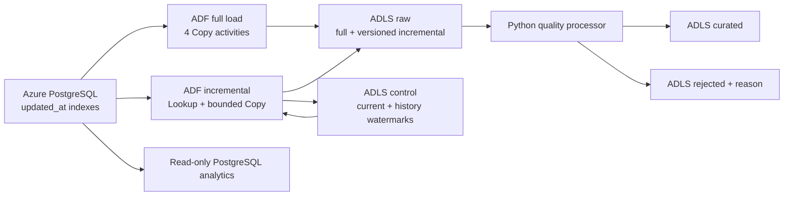

# Architecture

## Verified current Azure state

The PostgreSQL, ADF, and ADLS resources already exist in
`rg-order-revenue-dev`. The customers copy is preserved as the working baseline.

## Proposed deployment-ready state

## Design decisions

- The existing PostgreSQL and ADLS linked services are reused.
- The version-1 PostgreSQL connector supports Copy and Lookup, so the
  incremental control state is stored in ADLS rather than requiring a database
  Script activity or a linked-service upgrade.
- One watermark is maintained per table because their update rates and maximum
  timestamps differ.
- The current watermark advances only after all bounded counts match ADF
  `rowsCopied`. The 2026-08-15 controlled test exposed a watermark-only sink
  collision; the deployed correction now adds a unique `run_id` folder. A
  one-row run followed by a zero-row run proved append-only retention.
- Python performs quality processing without provisioning a paid transformation
  cluster. It writes every input row to curated or rejected output.
- Analytics stay in PostgreSQL; no separate warehouse is provisioned.

## Failure behavior

If a copy fails, a count differs, or watermark history cannot be written, the
current watermark file remains unchanged. A retry starts from the same old
boundary. If a failed attempt left a partial versioned raw file, downstream
primary-key and `updated_at` deduplication prevents duplicate curated keys.

No ADF definition in this repository has been deployed at this stage.
