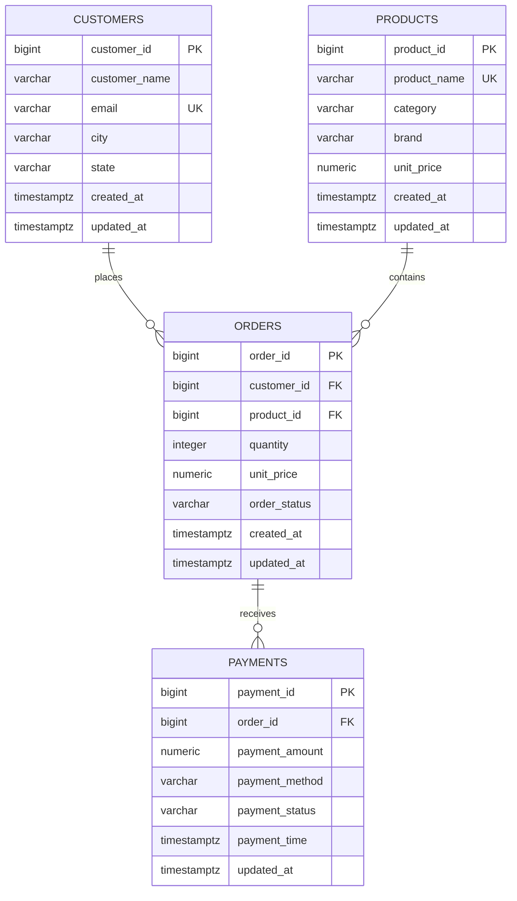

# Source data model

The definitions below were compared with the live `order_revenue_db` catalog on
2026-08-14 using a TLS 1.3 read-only PostgreSQL session. The live database
contains only these four public base tables.

The PostgreSQL database represents the current state of a small transactional system.

`orders.customer_id` and `orders.product_id` are nullable on purpose. A missing reference is a plausible source-data problem, and PostgreSQL foreign keys still prevent a non-null ID from pointing to a nonexistent row. Quantity is not constrained to be positive because the project needs to demonstrate detection and rejection of invalid quantities.

`unit_price` is copied onto the order so historical order value does not change when the product catalog price changes.

The operational `orders` table keeps one row per order. When an order is updated in Phase 2, `updated_at` changes. Repeated raw extracts in the lake can then contain multiple versions; downstream processing will keep the latest version with `ROW_NUMBER()`.

## Verified column definitions

| Table | Column | Live type | Nullable |
|---|---|---|---|
| customers | customer_id | bigint | no |
| customers | customer_name | varchar(120) | no |
| customers | email | varchar(255) | no |
| customers | city | varchar(80) | no |
| customers | state | varchar(80) | no |
| customers | created_at | timestamptz | no |
| customers | updated_at | timestamptz | no |
| products | product_id | bigint | no |
| products | product_name | varchar(180) | no |
| products | category | varchar(60) | no |
| products | brand | varchar(60) | no |
| products | unit_price | numeric(12,2) | no |
| products | created_at | timestamptz | no |
| products | updated_at | timestamptz | no |
| orders | order_id | bigint | no |
| orders | customer_id | bigint | yes |
| orders | product_id | bigint | yes |
| orders | quantity | integer | no |
| orders | unit_price | numeric(12,2) | no |
| orders | order_status | varchar(20) | no |
| orders | created_at | timestamptz | no |
| orders | updated_at | timestamptz | no |
| payments | payment_id | bigint | no |
| payments | order_id | bigint | no |
| payments | payment_amount | numeric(12,2) | no |
| payments | payment_method | varchar(20) | no |
| payments | payment_status | varchar(20) | no |
| payments | payment_time | timestamptz | no |
| payments | updated_at | timestamptz | no |

Primary keys are `customer_id`, `product_id`, `order_id`, and `payment_id`.
`customers.email` and `products.product_name` are unique. Orders reference
customers/products and payments reference orders. Live checks enforce positive
product/order prices, positive payment amounts, timestamp ordering, the four
order statuses, the four payment statuses, and the four payment methods defined
in `database/ddl/01_create_tables.sql`.

## Incremental fields

All four tables have `updated_at TIMESTAMPTZ NOT NULL`. Each has a composite
B-tree index on `(updated_at, primary_key)`. The deployed ADF pipeline therefore
uses `updated_at` as an independent per-table watermark and extracts the
half-open/closed range `(old_watermark, new_watermark]`.

The live database does not contain a `pipeline_watermark` table. The deployed
ADF design stores current and historical watermark files under `raw/_control/`
so it remains compatible with the existing version-1 PostgreSQL linked service
and does not modify operational source tables.
